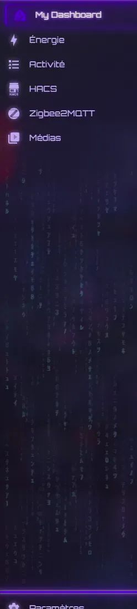

# Neon theme snippets

Small, self-contained snippets for Home Assistant themes. Each folder holds one snippet with its own README and assets. Take what you like for your own theme.

| Snippet | What it does | Needs |
|---|---|---|
| [sidebar-code-rain](sidebar-code-rain/) | Falling katakana under the last panel of the sidebar | card-mod |
| [theme-everywhere](theme-everywhere/) | Settings, Developer tools, Logbook, Media… inherit your theme's background and glass | `frontend: extra_module_url` |

## License

[MIT](LICENSE)
