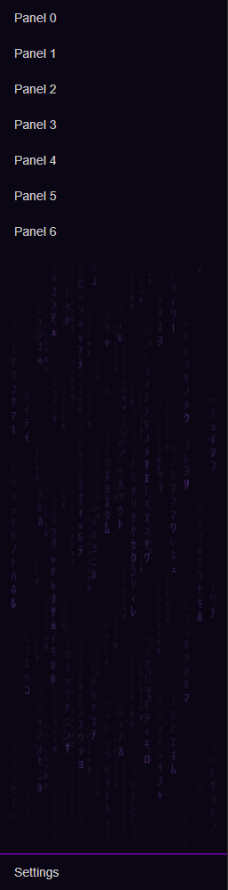

# Neon theme snippets

Small, self-contained CSS snippets for Home Assistant themes. Each folder holds one snippet with its own README and assets. Paste what you like into your own theme.

| Snippet | What it does | Needs |
|---|---|---|
| [sidebar-code-rain](sidebar-code-rain/) | Falling katakana under the last panel of the sidebar | card-mod |

## License

[MIT](LICENSE)
