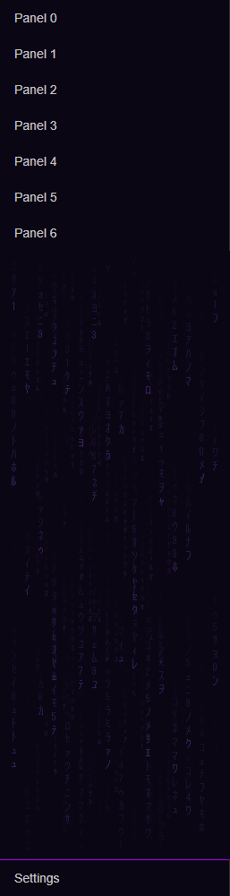

# Sidebar code rain

Falling katakana under the last panel of the Home Assistant sidebar. Pure CSS plus three SVG files: no custom card, no JavaScript in the browser.



- Starts right under the **last panel** and fills the free space down to the spacer. Add or remove a panel and it follows, there is nothing to recalibrate.
- Two layers (front and back) fall at different speeds, and each column has its own speed, so the overall pattern does not visibly loop.
- Half of the front streams **mutate** while falling, and a few stream heads flash white.
- Slow hue drift (violet to cyan) plus a rare glitch.
- Phones, touch tablets and `prefers-reduced-motion`: a still image, front layer only.

## Requirements

- [card-mod](https://github.com/thomasloven/lovelace-card-mod) 3.x, which provides the `card-mod-sidebar` theme key.
- A theme you can edit.

## Install

1. Copy `sidebar-rain-near.svg`, `sidebar-rain-far.svg` and `sidebar-rain-static.svg` to `/config/www/` (served as `/local/`).
2. Open your theme file and paste the content of [`card-mod-sidebar.yaml`](card-mod-sidebar.yaml) under your theme, at the same level as its variables.
   If your theme already has a `card-mod-sidebar:` block, append the CSS to it instead of adding a second key.
3. Reload themes: **Developer tools → Actions → `frontend.reload_themes`**. A browser refresh may be needed the first time.

## Customize

In the CSS:

| What | Where |
|---|---|
| Colors | the two `hsl()` in `@keyframes sb-drift` (and the `background` of `.wrapper::after`) |
| Hue drift speed | `sb-drift 20s` |
| Glitch frequency | `sb-glitch 23s` (once per cycle) |
| Back layer size | `156px 468px` in `mask-size` (65 % of the front layer) |
| Top / bottom fade | `50px` and `calc(100% - 80px)` in the `linear-gradient` |

Fall speed, mutation, flashes and layer opacity are baked into the SVGs. Edit the settings at the bottom of `generate.js`, then:

```sh
node generate.js            # front and back layers
node generate.js --static   # also the still image for touch devices
```

Copy the new SVGs to `/config/www/` and bump `?v=1` to `?v=2` in the CSS, otherwise browsers keep the old files in cache. The generator is deterministic: same settings, same files.

| Setting | Meaning |
|---|---|
| `speed` | average seconds for a column to fall 720 px |
| `spread` | how much column speeds differ (0 to 0.8) |
| `mutate` | share of streams whose glyphs change (0 to 1) |
| `twinkle` | roughly how many stream heads flash, out of ~60 |
| `seed` | another seed gives another layout |

## How it works

`.wrapper` in the sidebar is a flex column that holds only the panel list. Its `::after` becomes a flex item (`flex: 1; order: 99`) that takes exactly the space left under the list.

That pseudo-element is a solid color shown through a mask with three layers: `fade ∩ (front ∪ back)`. The SVGs animate themselves (SMIL): every column is drawn twice and slides down by its own height in a seamless loop. CSS only animates the color and the glitch.

## Caveats

- This relies on the internal structure of `ha-sidebar` (`div.wrapper` around the panel list), tested in October 2026. A Home Assistant frontend update can change it.
- The glyphs use the system font (MS Gothic, Yu Gothic, Hiragino Sans, Noto Sans CJK JP). Without any of them the browser falls back to another font, so the look may differ slightly.
- Animated SVG masks cost a little GPU. That's why touch devices get the still image.
