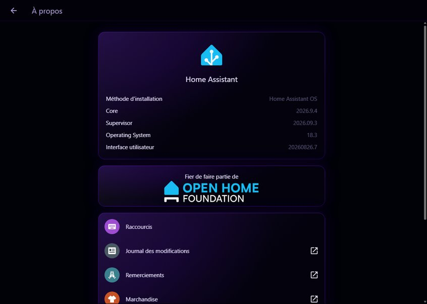
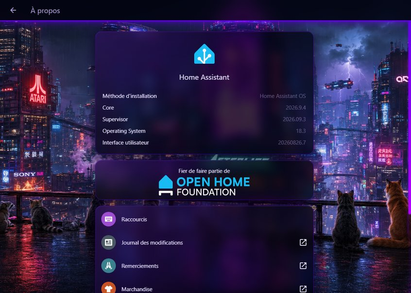

# Theme everywhere

Home Assistant themes stop at the dashboards. Settings, Developer tools, Logbook, Media and the traces keep an opaque background, whatever your `lovelace-background` is. This small script makes those pages inherit your theme: same full-screen background, same glass as your cards, neon header.

| Without | With |
|---|---|
|  |  |

- **Your theme does the styling.** The script adds no colors of its own: it only reads theme variables (`var(--lovelace-background)`, `var(--ha-card-background)`…). Change your theme or your background image and the pages follow, nothing to reload.
- **Missing variable = original rendering.** A theme without `lovelace-background` gets HA's normal background.
- Covers Settings (all sections, integration pages, tables, Apps), Developer tools, Logbook, Media browser, automation and script traces, toasts, notification drawer, and HACS (custom panel iframe).
- Optional extras, on by default: pulsing neon header, neon scrollbars and tinted text selection, and a **SIGNAL LOST** screen when the connection to Home Assistant drops (GLITCH the cat, hologram style, with a wink when it comes back).

## Install

1. Copy [`theme-everywhere.js`](theme-everywhere.js) to `/config/www/` (served as `/local/`).
2. Add it to `configuration.yaml`:
   ```yaml
   frontend:
     extra_module_url:
       - /local/theme-everywhere.js?v=1
   ```
   If you already have a `frontend:` block (for themes, say), add `extra_module_url` inside it rather than writing a second `frontend:` key.
3. Restart Home Assistant, then hard-refresh the browser (Ctrl+F5). In the companion app, reset the frontend cache from the app settings.

Two rules:

- **Use `extra_module_url`, not a dashboard resource.** Resources only load once a dashboard has been opened, so opening `/config` directly would show it unthemed. And it must be loaded as a module (`extra_module_url`, not `extra_js_url_es5`).
- **After updating the file, bump `?v=1` to `?v=2`**, otherwise browsers keep the old copy.

## Options

Add them to the URL, after `?v=1`:

| Option | Effect |
|---|---|
| `&signal_lost=0` | No SIGNAL LOST screen. Home Assistant's own "connection lost" toast stays (it is only hidden when the screen replaces it). |
| `&neon=0` | No pulsing header, neon scrollbars or tinted selection. Background and glass only. |

Example: `/local/theme-everywhere.js?v=1&neon=0`

## Theme variables it reads

| Variable | Used for | Without it |
|---|---|---|
| `lovelace-background` | full-screen page background | `primary-background-color` |
| `ha-card-background` (or `card-background-color`) | glass panels | — |
| `ha-card-backdrop-filter` | blur behind the glass | no blur |
| `ha-card-border-width`, `-color`, `-radius`, `-box-shadow` | glass panel border | 1px transparent, 12px radius |
| `rgb-card-background-color` | halo behind titles that sit on the image | black |
| `rgb-primary-color` | header border and glow, scrollbars, table lines | — |
| `app-header-backdrop-filter` | blur behind the header | no blur |
| `blacklight-color` | second color of the header pulse | `#B400FF` |
| `rgb-lavande`, `rgb-blacklight-color` | caret, selection, links (light tints read better than a dark primary on black) | `rgb-primary-color` |
| `warning-color` | integrations in error | `#ffb800` |

The look depends a lot on `ha-card-background` being **translucent** (e.g. `rgba(4, 2, 14, 0.78)`) with a `ha-card-backdrop-filter` such as `blur(12px) saturate(1.5)`. With an opaque card background you get opaque panels on top of your image.

### Two places a theme can already handle on its own

No script needed for these, just theme variables:

```yaml
# filled neutral buttons (trace picker, automation editor…): opaque #202020 by default
ha-color-fill-neutral-normal-resting: "rgba(4, 2, 14, 0.55)"
ha-color-fill-neutral-normal-hover: "rgba(98, 0, 234, 0.22)"
ha-color-fill-neutral-normal-active: "rgba(98, 0, 234, 0.30)"
# dialogs, and the bottom sheet on phones
ha-dialog-surface-background: "rgba(4, 2, 14, 0.96)"
```

## How it works

The Settings pages are built from Lit components, each with its own shadow root. Themes only set CSS variables at the top, and card-mod does not reach these components. The opaque bands come from rules inside those shadow roots.

The script wraps `Element.prototype.attachShadow`: each new shadow root gets one or more extra style sheets (constructed `CSSStyleSheet`), chosen by the host's tag name (`PLAN` in the code). Lit rewrites `adoptedStyleSheets` on every render, so the property is redefined on each root to keep these sheets last. Roots that existed before the script loaded are walked once. Custom panel iframes (HACS) get the same hook inside their own window.

The background is a fixed `::before` layer behind the page, like the one dashboards use, so it also shows under a translucent sidebar.

## Caveats

- It targets internal component and class names of the HA frontend, tested with **Home Assistant 2026.9.4 (frontend 20260826.7)**. A frontend update can rename one of them. In that case that one area goes back to its original rendering. Nothing breaks.
- Neon scrollbars use `::-webkit-scrollbar` (Chrome, Edge, Safari, the companion apps). Firefox keeps its own scrollbars.
- The header pulse is off on phones and touch tablets, and everything respects `prefers-reduced-motion`.
- Upstream proposal to get this into Home Assistant itself: [frontend discussion #54459](https://github.com/home-assistant/frontend/discussions/54459).

---

## En français

Le thème de Home Assistant s'arrête aux dashboards. Ce script étend votre thème aux pages Paramètres, Outils de développement, Journal, Médias et traces : même fond plein écran, même verre que vos cards, header néon. Il ne contient aucune couleur, il ne lit que les variables de votre thème. Une variable absente donne le rendu d'origine.

**Installation**

1. Copier `theme-everywhere.js` dans `/config/www/`.
2. Dans `configuration.yaml` :
   ```yaml
   frontend:
     extra_module_url:
       - /local/theme-everywhere.js?v=1
   ```
   Si un bloc `frontend:` existe déjà (pour les thèmes), ajouter `extra_module_url` dedans.
3. Redémarrer Home Assistant, puis Ctrl+F5 dans le navigateur.

**À savoir**

- `extra_module_url` obligatoire : une ressource de dashboard ne se charge pas si l'on ouvre directement `/config`.
- Après une mise à jour du fichier, passer `?v=1` à `?v=2`.
- Options dans l'URL : `&signal_lost=0` (pas d'écran SIGNAL LOST, le toast d'origine de HA revient) et `&neon=0` (fond et verre seulement, sans header pulsé ni scrollbars néon).
- Le rendu « verre » suppose un `ha-card-background` translucide avec un `ha-card-backdrop-filter` (par exemple `blur(12px) saturate(1.5)`).
